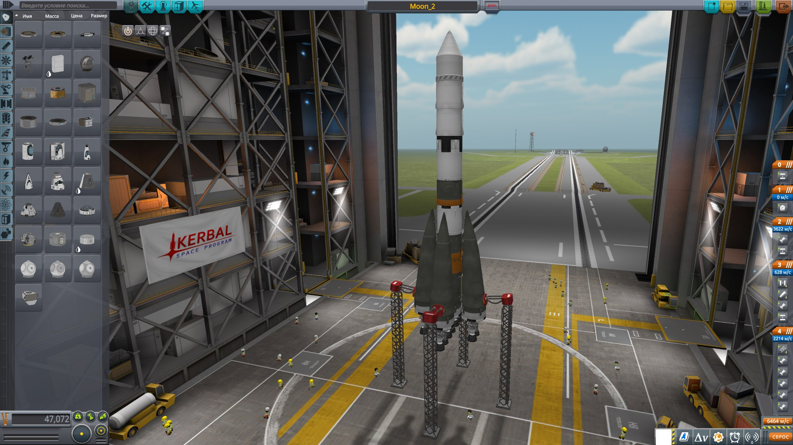
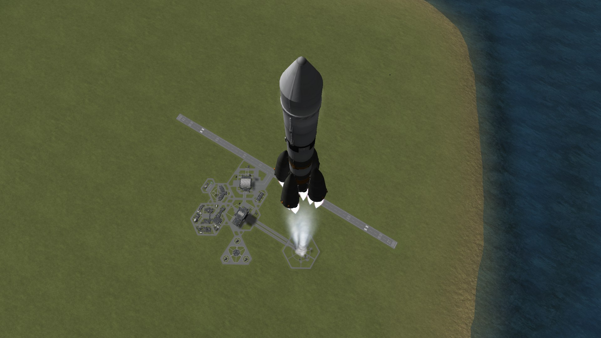
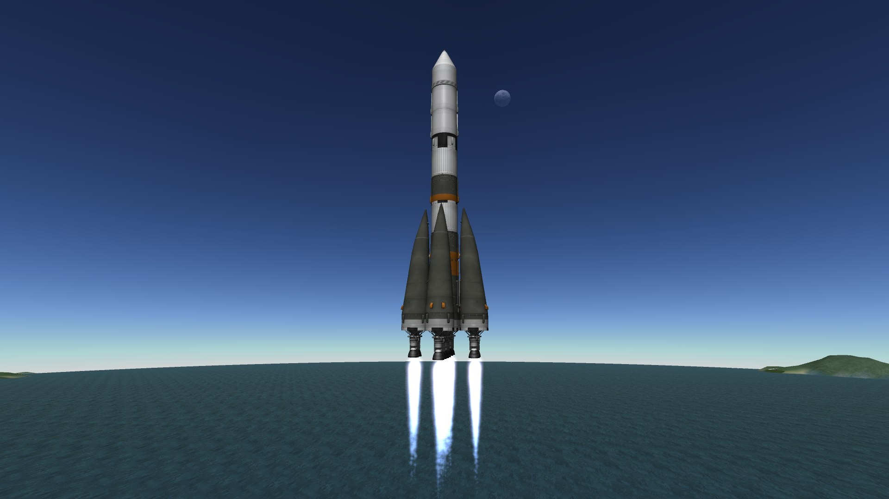

# Луна-2 (CosmoLab)
### Состав команды
- Колесник Дмитрий - Тимлид, мастер исторических сведений
- Марьин Дмитрий - Автор программы для KSP
- Солодова София - Составитель презентации, продакшн менеджер
- Иванов Владимир - Создатель математической модели полета, монтажер

### Модель ракеты создана в конструкторе Kerbal Space Program

Файл с моделью [ракеты](Spaceship.craft)

### Программы 
Программы для автопилота написаны на языке **Python** с использованием библиотек **Numpy, MatPlotLib, kRPC**
- Программа для [Логирования KSP](Programs/logger.py)
- Программа для [Рассчета Физической модели](Programs/model.py)

### Ссылка на материалы проекта и отчет
https://drive.google.com/drive/u/1/folders/1Zxl3asc7zUe3-6m6FWK4SXwLW-s6FiWZ

### Ссылка на видеоотчет на YouTube
https://youtu.be/m11wRrQkUeE
